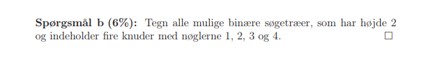
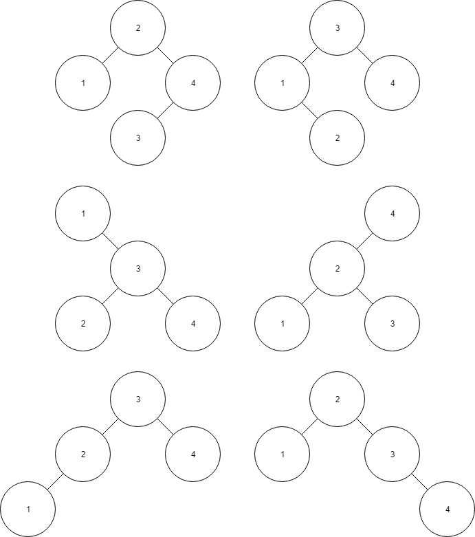
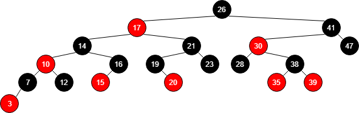
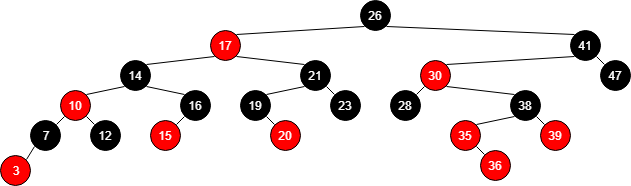

# Exercise 1




# Exercise 2
c is invalid when going to 912, as this is larger than previous 911

# Exercise 3
```kotlin
fun treePredecessor(x) {
    if(x.left != null) {
        return treeMaximum(x.left)
    }
    y = x.p
    while(y != null && x == y.left) {
        x = y
        y = y.p
    }
    return y
}
```

# Exercise 4
Best case: O(n*lg(n)) 
Worst case: O(n^2) 

# Exercise 5
For each element if takes O(log(n)) insertion time in the binary tree. 
As this has to be done for each element, the log(n) should with the numbers of 
elements this needs to be done for, in this case n. Thus we have O(n*log(n)). 

# Exercise 6
The min-heap property cannot be used to print in sorted order in O(n), as each getMin takes lg(n). 
This then has to be done for each element, which pushes the time to n * lg(n)

# Exercise 7
Ligesom INORDER-TREE-WALK, lad funktionen fortsætte mod venstre, så længe x.key > a.  
Dette kommer til at tage lg(n). Når x.key ikke længere er mere end a, så ikke længere gå mod
venstre. Udfør INORDER-TREE-WALK derfra, og lad den forsætte mod højre, så længe x.key < b.
Denne forsættelse vil tage m. Altså har vi en køretid på theta(m + lg(n)). 

# Exercise 8
Before:  
  

After:  
  
The inserted node is always red. This breaks the red/black tree, as we have two red after each other.  
It can't be black either, as that would violate the principle, that each paath from root the leaf 
should have the same amount of black nodes. 

# Exercise 9
Følgende er røde-sorte træer:  
T3, T4, T8  
  
Følgende er _ikke_, fordi:  
T1: Overholder ikke inorder  
T2: Rod er ikke sort  
T5: 2 røde i træk  
T6: Ikke samme antal sorte på alle stier  
T7: Ikke samme antal sorte på alle stier  


